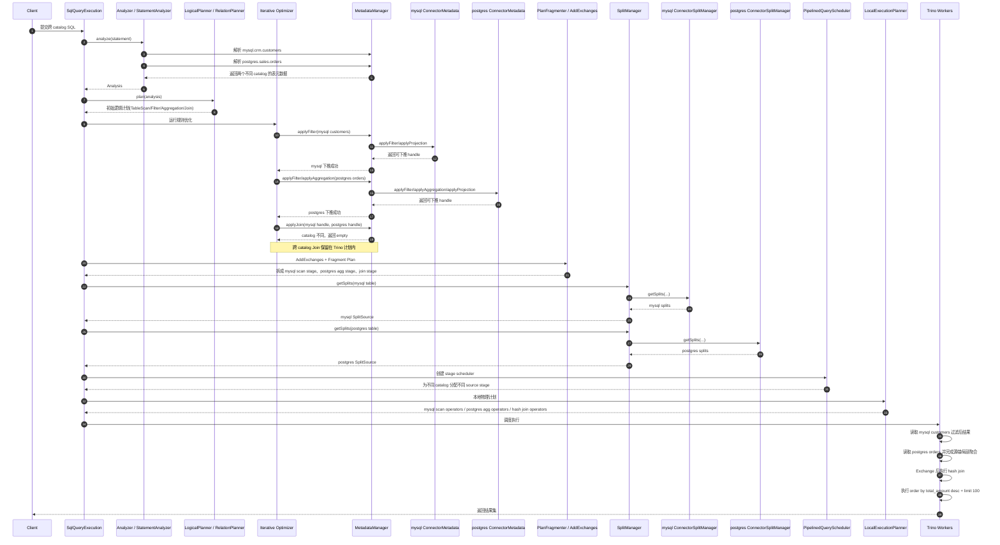

# Trino 联邦查询实现机制与源码时序分析报告

## 1. 文档目的

本文档基于 Trino 源码目录 `/Volumes/osdisk/java_code/01-open_source/trino-master`，分析 Trino 如何实现跨数据源 SQL 联邦查询，重点回答以下问题：

- Trino 联邦查询的真实实现边界是什么
- SQL 从解析到执行经过哪些核心类和阶段
- 哪些能力由 connector 承担，哪些能力由 Trino 引擎承担
- 跨 catalog Join 为什么通常不能下推
- 一个具体跨源 SQL 在源码层面的执行时序是什么

本文只基于本地源码分析，不基于二手资料推测。

## 2. 结论摘要

Trino 的联邦查询本质不是“把一条 SQL 原样分发给多个数据库协同执行”，而是：

- 先把整条 SQL 解析、校验并转换为统一逻辑计划
- 再把不同数据源统一抽象为 `catalog -> connector -> table handle -> split -> page source`
- 每个 connector 只负责自己能够承接的扫描和下推能力
- 不能下推的部分，尤其跨 catalog 的 Join、Exchange、全局聚合、排序，统一由 Trino 分布式执行引擎完成

因此，Trino 的联邦查询本质可以概括为：

- 强统一语义层
- 强统一执行层
- 局部下推到数据源
- 跨源运算回收至 Trino 引擎

最关键的判断有五条：

1. Trino 联邦能力首先来自统一 `catalog.schema.table` 名字空间。
2. 每张表的读取都通过各自 connector 的 `ConnectorSplitManager` 独立产出 split。
3. 谓词、投影、聚合、TopN、Limit 等能力能否下推，取决于 connector 对 SPI 的实现。
4. 跨 catalog Join 不能下推到 connector，Trino 在 `MetadataManager.applyJoin(...)` 中直接限制了这一点。
5. 跨源 Join 的真实执行方式是“各源先出数，再由 Trino worker 通过 Exchange + Hash Join 完成分布式联接”。

## 3. 源码分析范围

本次重点分析以下类：

- `core/trino-main/src/main/java/io/trino/execution/SqlQueryExecution.java`
- `core/trino-main/src/main/java/io/trino/sql/analyzer/Analyzer.java`
- `core/trino-main/src/main/java/io/trino/sql/analyzer/StatementAnalyzer.java`
- `core/trino-main/src/main/java/io/trino/metadata/MetadataUtil.java`
- `core/trino-main/src/main/java/io/trino/sql/planner/LogicalPlanner.java`
- `core/trino-main/src/main/java/io/trino/sql/planner/RelationPlanner.java`
- `core/trino-main/src/main/java/io/trino/sql/planner/optimizations/AddExchanges.java`
- `core/trino-main/src/main/java/io/trino/sql/planner/iterative/rule/PushJoinIntoTableScan.java`
- `core/trino-main/src/main/java/io/trino/sql/planner/LocalExecutionPlanner.java`
- `core/trino-main/src/main/java/io/trino/split/SplitManager.java`
- `core/trino-main/src/main/java/io/trino/execution/scheduler/PipelinedQueryScheduler.java`
- `core/trino-main/src/main/java/io/trino/metadata/MetadataManager.java`
- `core/trino-spi/src/main/java/io/trino/spi/connector/ConnectorMetadata.java`
- `core/trino-spi/src/main/java/io/trino/spi/connector/ConnectorSplitManager.java`

## 4. Trino 联邦查询的总体机制

### 4.1 统一名字空间先解决“多数据源可被同一条 SQL 引用”

Trino 先通过 `catalog.schema.table` 建立统一对象引用模型。

`MetadataUtil.createQualifiedObjectName(...)` 的逻辑非常直接：

- 三段名时，直接解析为 `catalog / schema / object`
- 两段名时，从 session 补 catalog
- 一段名时，从 session 补 catalog 和 schema

这意味着 Trino 联邦查询的第一层基础不是执行器，而是统一对象寻址模型。

### 4.2 SQL 先进入统一分析与逻辑计划阶段

在 `SqlQueryExecution` 中，查询执行主链路先做：

1. analyze
2. logical plan
3. optimizer
4. fragment / scheduler
5. local execution

其中：

- `Analyzer` 负责统一语义分析
- `StatementAnalyzer` 负责把表、列、表达式绑定到元数据
- `LogicalPlanner` 负责生成基础逻辑计划
- `RelationPlanner` 负责把 `FROM / JOIN / TABLE` 等关系型结构转成 `PlanNode`

因此，在计划层 Trino 并不区分 “MySQL SQL” 和 “Hive SQL”，而是先把它们统一变成同一棵计划树。

### 4.3 Connector SPI 定义了联邦查询的“源端能力边界”

Trino 的联邦不是每个数据源都实现一个完整 SQL 引擎接口，而是只要求 connector 在标准 SPI 上汇报能力。

核心接口有两个：

- `ConnectorMetadata`
- `ConnectorSplitManager`

其中最关键的方法包括：

- `applyFilter`
- `applyProjection`
- `applyAggregation`
- `applyJoin`
- `applyTopN`
- `applyLimit`
- `getSplits`

含义是：

- 如果 connector 能承接一个逻辑子树，就返回新的 handle
- 如果不能承接，就返回 `Optional.empty()`
- Trino 优化器根据返回结果决定是否下推

这决定了 Trino 的联邦实现方式是“统一计划 + 局部能力协商”，而不是“统一 SQL 远端全量执行”。

### 4.4 每个数据源独立切 split，再统一进入 Trino 执行流水线

`SplitManager.getSplits(...)` 会根据 `TableHandle.catalogHandle()` 找到对应 catalog 的 `ConnectorSplitManager`，再调用 connector 的 `getSplits(...)`。

这表示：

- MySQL 表由 MySQL connector 切 split
- PostgreSQL 表由 PostgreSQL connector 切 split
- Hive / Iceberg / Kafka 各自走自己的 split 生产逻辑

不同源各自产生 split，但返回到 Trino 后统一抽象为 `SplitSource`，再进入统一调度与算子执行链路。

### 4.5 不能下推的联邦操作由 Trino 引擎完成

这是 Trino 联邦查询的核心事实。

`AddExchanges` 会在逻辑计划上补充分布式执行所需的：

- `REMOTE REPARTITION`
- `REPLICATE`
- `GATHER`

随后 `LocalExecutionPlanner` 会把 `JoinNode`、`AggregationNode`、`ExchangeNode` 等转换成物理算子。

对 Join 而言，核心落点在：

- `visitJoin(...)`
- `createLookupJoin(...)`

最终会构造出：

- `HashBuilderOperator`
- `LookupJoinOperatorFactory`
- `DynamicFilterSourceOperator`

这说明跨源 Join 的真实执行位置不在源端，而在 Trino worker。

## 5. Trino 为什么能做联邦查询

Trino 能做联邦查询，不是因为它“懂所有数据库 SQL”，而是因为它做了三层统一：

### 5.1 统一元数据模型

所有外部数据源都被统一成：

- `CatalogHandle`
- `TableHandle`
- `ColumnHandle`

这样优化器面对的不是多种数据库对象，而是统一元数据抽象。

### 5.2 统一执行输入模型

所有源端数据都被统一抽象成：

- `ConnectorSplit`
- `ConnectorSplitSource`
- `ConnectorPageSource`

这样调度器和执行器不需要关心底层是 JDBC、Hive 还是对象存储。

### 5.3 统一算子模型

所有不能下推的逻辑最终都会回到 Trino 自己的：

- Join
- Aggregation
- Sort
- Exchange
- Filter
- Project

这一点决定了 Trino 是联邦“查询引擎”，而不是联邦“SQL 路由器”。

## 6. Trino 联邦查询的关键边界

### 6.1 跨 catalog Join 不能下推到 connector

这是源码里最重要的约束。

`MetadataManager.applyJoin(...)` 中首先判断左右表的 `catalogHandle` 是否一致：

- 一致，才允许继续调用 connector 的 `applyJoin(...)`
- 不一致，直接返回 `Optional.empty()`

因此：

- 同一 catalog 内，connector 可能承接整段 join pushdown
- 不同 catalog 之间，join 不会被推给 connector

这意味着 Trino 的跨源 Join 天生是引擎侧 Join。

### 6.2 一个 stage 内通常只读同一个 catalog

`PipelinedQueryScheduler` 中有显式校验：

- 同一 stage 内的 table scan 应来自同一个 catalog

这意味着典型跨源查询通常会被拆成：

- 一个 stage 读取源 A
- 一个 stage 读取源 B
- 上游 stage 做 Exchange 后再 Join / 聚合

这也是 Trino 联邦执行在调度层面的实现特征。

### 6.3 下推是局部的，不是全量的

Trino 优化器能尝试下推：

- Filter
- Projection
- Aggregation
- TopN
- Limit
- Join

但这些下推全部受 connector 实现能力约束。

因此 Trino 联邦查询的性能核心，不在于“是否跨源”，而在于：

- 跨源前能否把各源数据量压到足够小

## 7. 具体 SQL 示例

为避免把“源端可下推”和“跨源必须回收至 Trino”混在一起，下面选择一个结构清晰的跨 catalog SQL：

```sql
SELECT
    c.customer_id,
    c.customer_name,
    o.total_amount
FROM mysql.crm.customers c
JOIN (
    SELECT
        customer_id,
        SUM(amount) AS total_amount
    FROM postgres.sales.orders
    WHERE order_date >= DATE '2025-01-01'
    GROUP BY customer_id
) o
    ON c.customer_id = o.customer_id
WHERE c.status = 'ACTIVE'
ORDER BY o.total_amount DESC
LIMIT 100;
```

假设：

- `mysql` 是一个 JDBC catalog，对应 CRM 库
- `postgres` 是另一个 JDBC catalog，对应订单库

这个 SQL 具备三个典型特征：

1. `customers` 与 `orders` 分属不同 catalog
2. `orders` 子查询内部是单 catalog 聚合，具备下推机会
3. 外层 Join 是跨 catalog Join，必须由 Trino 执行

## 8. 示例 SQL 的源码级执行分解

### 8.1 解析与分析阶段

Trino 收到 SQL 后：

1. `Analyzer` 启动分析
2. `StatementAnalyzer` 遇到 `mysql.crm.customers` 与 `postgres.sales.orders`
3. `createQualifiedObjectName(...)` 将它们解析为两个不同 `QualifiedObjectName`
4. 元数据层进一步解析为两个不同 `CatalogHandle`

结果：

- `customers` 属于 `mysql`
- `orders` 属于 `postgres`

这个信息会贯穿后面的 `TableHandle`、`SplitSource`、Stage 和调度逻辑。

### 8.2 初始逻辑计划

`RelationPlanner` 和 `LogicalPlanner` 会先生成近似如下的逻辑结构：

```text
Limit 100
  └─ Sort total_amount DESC
      └─ Join (c.customer_id = o.customer_id)
          ├─ Filter c.status = 'ACTIVE'
          │   └─ TableScan mysql.crm.customers
          └─ Aggregation group by customer_id, sum(amount)
              └─ Filter order_date >= DATE '2025-01-01'
                  └─ TableScan postgres.sales.orders
```

这里仍然只是统一逻辑树，还没有决定哪些步骤下推、哪些步骤由 Trino 自己做。

### 8.3 单源下推阶段

优化器会尝试做如下事情：

#### 对 `mysql.crm.customers`

- `c.status = 'ACTIVE'` 尝试走 `applyFilter`
- 只需要 `customer_id`、`customer_name`、`status` 相关列，尝试走 `applyProjection`

#### 对 `postgres.sales.orders`

- `order_date >= DATE '2025-01-01'` 尝试走 `applyFilter`
- `GROUP BY customer_id, SUM(amount)` 尝试走 `applyAggregation`
- 输出只保留 `customer_id`、`total_amount`，尝试走 `applyProjection`

如果 `postgres` connector 支持聚合下推，那么 orders 侧可以把大部分工作压到 PostgreSQL 执行。

### 8.4 跨源 Join 下推失败并回退引擎执行

当优化器尝试把外层 Join 整体下推时，会进入 `PushJoinIntoTableScan` -> `MetadataManager.applyJoin(...)`。

由于左右两侧来自：

- `mysql`
- `postgres`

两个 `catalogHandle` 不相等，因此 `applyJoin(...)` 直接返回空。

于是结果是：

- orders 子查询尽量在 PostgreSQL 内完成
- customers 过滤尽量在 MySQL 内完成
- 两边结果回收到 Trino，再做 Join、排序、Limit

### 8.5 物理执行阶段

`AddExchanges` 会给 Join 两侧补充 Exchange。随后：

- MySQL 侧 stage 读取 `customers`
- PostgreSQL 侧 stage 读取并聚合 `orders`
- 上游 Join stage 根据策略执行 repartition join 或 broadcast join
- `LocalExecutionPlanner` 把 Join 规划成 lookup hash join

最终 `total_amount DESC LIMIT 100` 在 Join 结果上继续执行。

## 9. 示例 SQL 的源码级执行时序图



## 10. 示例 SQL 的阶段视图

可将该 SQL 粗略理解为三个执行阶段：

```text
Stage A: mysql scan stage
  TableScan(mysql.crm.customers)
  -> Filter(status='ACTIVE')
  -> Project(customer_id, customer_name)

Stage B: postgres aggregate stage
  TableScan(postgres.sales.orders)
  -> Filter(order_date >= '2025-01-01')
  -> Aggregation(group by customer_id, sum(amount))

Stage C: Trino join stage
  Exchange(Stage A output)
  Exchange(Stage B output)
  -> Hash Join(customer_id)
  -> Order By(total_amount desc)
  -> Limit 100
```

这个阶段视图正好对应 Trino 联邦查询的真实职责分工：

- Stage A/B：尽量在源侧缩小数据量
- Stage C：统一在 Trino 引擎完成跨源汇合

## 11. 对本项目的工程启示

从数据服务平台角度看，Trino 的联邦查询机制带来以下启示：

### 11.1 优势

- 跨数据源查询能力是产品内建能力，不需要自研分布式执行器
- connector SPI 边界清晰，异构源接入模型成熟
- 对跨源查询、分析类 SQL、交互式查询场景非常适合

### 11.2 限制

- 跨 catalog Join 无法下推，数据量大时网络与内存成本明显
- 性能高度依赖各 connector 的 pushdown 能力
- 更适合作为独立查询平台，不适合作为轻量嵌入式规划内核

### 11.3 对联邦 SQL 设计的直接建议

- 尽量把过滤、列裁剪、局部聚合前移到单源子查询内部
- 避免直接对两个超大跨源明细表做 Join
- 优先把跨源 Join 的一侧预聚合或预裁剪成小结果集
- 把 Trino 视为“跨源汇合与统一执行层”，而不是“任意 SQL 都能高效跨源下推”的黑盒

## 12. 最终结论

Trino 的 SQL 联邦查询实现机制可以一句话总结为：

先用统一 Planner 生成单一计划树，再通过 connector SPI 把各数据源能承接的部分局部下推，最后由 Trino 分布式执行引擎完成跨源数据交换、Join、聚合和结果返回。

因此，Trino 的联邦查询是：

- 真正可用的联邦执行平台
- 但不是跨源全量透明下推平台

如果把这点理解清楚，Trino 的能力边界就很明确：

- 单源内，尽量 pushdown
- 跨源间，统一由 Trino 算

